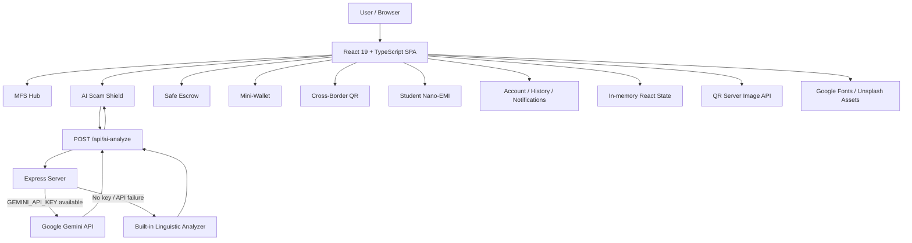

<p align="center">
  
</p>

> A full-stack React + TypeScript hackathon prototype for a next-generation Bangladesh mobile financial service (MFS), combining familiar wallet services with AI scam detection, a two-minute safety escrow, PIN-less micro-payments, cross-border QR payments, and student nano-EMI.

---
## Live Prototype: https://hackathon-project-ai-dev-fest-opay.vercel.app/
---
## Table of Contents

- [Project Overview](#project-overview)
- [Why This Project Exists](#why-this-project-exists)
- [Core Ideas](#core-ideas)
- [Feature Status Legend](#feature-status-legend)
- [Complete Feature List](#complete-feature-list)
  - [MFS Home and Wallet](#1-mfs-home-and-wallet)
  - [Send Money and Safe-Hold Escrow](#2-send-money-and-safe-hold-escrow)
  - [Cash In](#3-cash-in)
  - [Cash Out](#4-cash-out)
  - [Mobile Recharge](#5-mobile-recharge)
  - [Bill Payment](#6-bill-payment)
  - [Savings and DPS](#7-savings-and-dps)
  - [Fund Transfer](#8-fund-transfer)
  - [Request Money](#9-request-money)
  - [Merchant Payment and Bangla QR](#10-merchant-payment-and-bangla-qr)
  - [Refer and Earn](#11-refer-and-earn)
  - [NPSB / Inter-MFS Transfer](#12-npsb--inter-mfs-transfer)
  - [Additional Payment Services](#13-additional-payment-services)
  - [AI Scam Shield](#14-ai-scam-shield)
  - [Safe Escrow Vault](#15-safe-escrow-vault)
  - [Biometric / PIN Authorization](#16-biometric--pin-authorization)
  - [Mini-Wallet](#17-mini-wallet)
  - [Cross-Border QR Payment](#18-cross-border-qr-payment)
  - [Student Nano-EMI](#19-student-nano-emi)
  - [Account and Profile](#20-account-and-profile)
  - [Notifications](#21-notifications)
  - [Transaction History and Receipts](#22-transaction-history-and-receipts)
  - [Bilingual and Responsive UI](#23-bilingual-and-responsive-ui)
- [AI Scam Detection](#ai-scam-detection)
- [Application Architecture](#application-architecture)
- [Technology Stack](#technology-stack)
- [Project Structure](#project-structure)
- [State and Data Model](#state-and-data-model)
- [Backend API](#backend-api)
- [Environment Variables](#environment-variables)
- [Getting Started](#getting-started)
- [Available Scripts](#available-scripts)
- [Important User Flows](#important-user-flows)
- [Security Design](#security-design)
- [Prototype vs Production Integrations](#prototype-vs-production-integrations)
- [External Services Used](#external-services-used)
- [Known Limitations and Development Notes](#known-limitations-and-development-notes)
- [Recommended Production Roadmap](#recommended-production-roadmap)
- [Hackathon Highlights](#hackathon-highlights)
- [License](#license)

---

## Project Overview

**Opay** is a full-stack financial technology prototype designed around the everyday needs and risks of mobile financial service users in Bangladesh.

The project combines conventional MFS functionality such as sending money, cash-in, cash-out, mobile recharge, bill payment, bank/card transfers, Bangla QR and transaction history with several experimental financial-safety and inclusion features:

1. **AI Scam Shield** - analyzes suspicious SMS messages and phone-call scenarios.
2. **2-Minute Safe-Hold Escrow** - temporarily holds eligible transfers so the sender can recall a suspicious payment.
3. **Mini-Wallet** - a capped, low-value wallet for fast PIN-less micro-payments.
4. **Cross-Border QR** - a prototype travel-payment flow with passport/visa verification and foreign QR settlement.
5. **Student Nano-EMI** - a zero-interest installment concept with a small student credit limit.

The application is implemented as a **React 19 + TypeScript** single-page application backed by an **Express** server. The server exposes an AI analysis endpoint and can optionally call the **Google Gemini API**. If no Gemini key is configured, the application automatically uses its own local/deterministic linguistic fraud analyzer.

> **Project status:** Hackathon / proof-of-concept. Financial, KYC, biometric, settlement, regulatory, blacklist, telecom, and law-enforcement integrations are simulated unless explicitly noted otherwise.

---

## Why This Project Exists

Digital financial services are fast and convenient, but users can still be exposed to phishing, social engineering, mistaken transfers, fake support calls, coercive phone scams and payment mistakes. At the same time, many small daily transactions need to be faster and simpler than a traditional wallet flow.

This project explores a single MFS experience that can:

- provide normal wallet and payment services;
- detect suspicious financial communication;
- create a short recovery window before risky transfers are finalized;
- support very small payments with less friction;
- explore interoperable and international QR payments;
- offer controlled nano-credit for students;
- present security explanations in a user-friendly way.

---

## Core Ideas

| Idea | What the project demonstrates |
|---|---|
| **Safety before settlement** | Eligible Send Money transfers can enter a two-minute escrow instead of being treated as irreversible immediately. |
| **AI-assisted fraud awareness** | SMS/call text is scored using scam patterns, caller topology, call duration and optionally Gemini. |
| **Low-friction micro-payments** | A separate wallet capped at BDT 1,000 supports PIN-less payments of up to BDT 500. |
| **Travel payments** | A passport/visa verification concept unlocks cross-border QR payment demos for India and UAE. |
| **Student financial access** | Verified students can use a BDT 20,000 nano-EMI limit with 3/6/12-month installment options. |
| **Bangladesh-first UX** | Bangla/English language support, Bangla QR, local operators, utility providers, NPSB/MFS names and Bangladesh-oriented scam patterns. |

---

## Feature Status Legend

The repository intentionally mixes working local flows with simulated external integrations. The following labels are used throughout this README:

- **Implemented** - the feature has working application logic/state in the current repository.
- **Simulated** - the UI and local state flow work, but a real external provider/network is not connected.
- **Demo/UI** - the interface is present, but the action is mainly a demonstration or alert.

---

# Complete Feature List

## 1. MFS Home and Wallet

**Status: Implemented locally**

The main MFS dashboard acts as the service hub for the application.

### Included behavior

- Main wallet balance with tap-to-reveal behavior.
- Demo starting fiat balance of **BDT 100,000** in `App.tsx`.
- Promotional offer carousel with automatic rotation and manual navigation dots.
- Main MFS services grid.
- Additional payment-services grid.
- Other-services grid.
- Quick entry points for the three experimental/hackathon features.
- Responsive top navigation and mobile bottom navigation.
- Security and escrow badges in the header.
- Audio feedback for selected actions.

The promotional carousel currently includes demo campaigns for:

- Robi cashback;
- UCB card add-money bonus;
- cashless shopping discounts;
- zero-fee electricity and gas bill payments.

---

## 2. Send Money and Safe-Hold Escrow

**Status: Implemented locally; real MFS settlement is simulated**

Send Money is connected to the project's safety-escrow concept.

### Flow

1. User enters a recipient and transfer amount.
2. The app checks whether the recipient description appears to be a close relative.
3. If the two-minute escrow option is enabled and the recipient is **not** identified as a close relative, the transfer is placed in escrow.
4. The amount is deducted from the local wallet state.
5. A transaction with `in_escrow_hold` status is created.
6. A corresponding escrow object is created with a 120-second countdown.
7. The user can later approve/release or recall the transfer.
8. Direct transfers and escrow approvals use the authorization modal.

### Close-relative detection

The current implementation recognizes family terms such as mother, father, brother, sister, wife, husband, son, daughter and several Bangla/colloquial equivalents. These transfers can bypass the safety hold in the current demo logic.

### Risk hinting

New escrow transfers receive a simple local risk score. Demo recipients that look unknown/suspicious receive a higher score than normal recipients.

> The countdown reaching zero currently does **not** automatically release the money. Final release remains a user action in this prototype.

---

## 3. Cash In

**Status: Implemented locally; funding rails are simulated**

Supported UI funding sources include:

- UCB Bank NetBanking;
- Visa/Mastercard;
- Internet Banking / NPSB;
- Opay/Upay co-branded card concept.

A successful local cash-in updates the wallet balance and can create transaction history in the application flow.

---

## 4. Cash Out

**Status: Implemented locally; agent/network settlement is simulated**

The Cash Out flow includes:

- recipient/agent information;
- amount input;
- calculated fee;
- authorization step;
- wallet-balance deduction.

The current fee formula is approximately **BDT 14 per BDT 1,000**, calculated proportionally in code.

---

## 5. Mobile Recharge

**Status: Implemented locally; telecom fulfillment is simulated**

Supported operator presets:

- Grameenphone;
- Robi;
- Banglalink;
- Teletalk;
- Airtel.

The UI supports regular recharge plus demo bundle presets, including data/minute packages.

---

## 6. Bill Payment

**Status: Implemented locally; biller settlement is simulated**

Built-in providers cover common Bangladesh utility and education categories.

### Electricity

- DPDC;
- DESCO;
- NESCO;
- Polli Bidyut / BREB.

### Water

- Dhaka WASA;
- Chattogram WASA.

### Gas

- Titas Gas.

### Internet

- Link3;
- Carnival Internet.

### Education

- University of Dhaka;
- North South University.

The pay-bill flow uses the authorization modal and records a local transaction.

---

## 7. Savings and DPS

**Status: Prototype / simulated**

The savings module includes:

- **Create New DPS** and **My Active DPS** views;
- monthly contribution options of BDT 500, 1,000, 2,000 and 5,000;
- tenure options from one to five years;
- displayed interest-rate presets;
- nominee field;
- maturity preview;
- example active DPS plan;
- simulated installment payment action.

Displayed tenure/rate options include:

| Tenure | Displayed rate |
|---|---:|
| 1 year | 9.00% |
| 2 years | 9.25% |
| 3 years | 9.50% |
| 5 years | 9.75% |

> The current maturity and newly created-plan calculations are simplified demo logic and should not be treated as banking calculations.

---

## 8. Fund Transfer

**Status: Demo/UI**

The module provides transfer forms for:

- bank account transfer;
- Visa debit card;
- Opay/Upay co-branded card.

Example bank choices include:

- UCB;
- City Bank;
- BRAC Bank;
- Dutch-Bangla Bank;
- Islami Bank.

The current submit action is a simulated success flow and is not connected to a banking API.

---

## 9. Request Money

**Status: Demo/UI**

Users can prepare a money request using:

- a phone number/contact;
- amount;
- note/reference.

Demo saved contacts include family, office and friend entries. The final send action is simulated.

---

## 10. Merchant Payment and Bangla QR

**Status: Mixed - QR generation works through an external QR image service; scanning/settlement are simulated**

### Merchant payment

The standard merchant flow supports:

- merchant number;
- amount;
- reference;
- simulated payment confirmation.

### My Receive QR

The Bangla QR modal can generate a receive-QR image from a payload containing the demo wallet number/name and BDT currency.

The generated payload follows the project's internal format similar to:

```text
OPAY:<phone>:<name>:BDT
```

The image is generated using the public QR Server API.

### QR scanning

The scanner interface includes:

- animated scanning/viewfinder UI;
- image-file upload;
- demo merchant results;
- verified-merchant presentation.

Current image upload does not decode arbitrary QR pixels. It simulates a successful merchant result after the user supplies an image.

---

## 11. Refer and Earn

**Status: Demo/UI**

The referral module includes:

- demo referral earnings;
- referred-friends count;
- shareable referral link;
- clipboard copy;
- WhatsApp, Messenger and SMS action buttons.

The social buttons currently provide interface/audio feedback rather than real deep-link integrations.

---

## 12. NPSB / Inter-MFS Transfer

**Status: Demo/UI**

The project presents an interoperable wallet-transfer concept with destinations for:

- bKash;
- Nagad;
- Rocket;
- Cellfin;
- tap;
- Upay.

The UI includes destination selection, recipient wallet, amount and a displayed switch fee. Actual NPSB or inter-MFS clearing is not connected.

---

## 13. Additional Payment Services

**Status: Demo/UI**

The MFS hub exposes a broad service catalog.

### Payment services

- Traffic Fine
- Toll Payment
- Government Payment
- Education
- NGO
- Insurance
- Donation
- Zakat Payment
- Ticket
- GP FlexiPlan
- Hotel
- Application Fee
- Othoba
- Metro Rail

### Other services

- Payoneer
- Upay Wheel
- Music
- Library
- Games

### Additional tiles

- Upay Card
- Upay Offer

These services share generic prototype payment/action forms; they are not connected to the named third-party platforms.

---

## 14. AI Scam Shield

**Status: Implemented analysis workflow; real call/SMS interception is not implemented**

AI Scam Shield is one of the main project innovations. It provides a sandbox for analyzing suspicious SMS and phone-call scenarios.

### Main capabilities

- Analyze an **SMS** or **call scenario**.
- Enter message/call transcript manually.
- Enter caller/sender number.
- Adjust call duration between short and prolonged-call examples.
- Run analysis through the server API.
- Use Google Gemini when a valid API key is available.
- Automatically fall back to the built-in linguistic analyzer if Gemini is missing or fails.
- Display a decimal threat score.
- Classify risk as `LOW`, `MEDIUM`, `HIGH` or `CRITICAL`.
- Show **normal-style** vs **scam-style** match percentages.
- Detect/red-flag phishing and social-engineering phrases.
- Explain why the input is suspicious or normal.
- Generate safety recommendations.
- Evaluate call-duration patterns.
- Detect suspicious international/VoIP caller patterns.
- Track analyzed events in a local monitored feed.
- Inspect individual events in detail.
- Re-analyze the feed using the local analyzer.
- Trigger a simulated block/report action.

### Included demo scenarios

The sandbox contains presets for:

- fake lottery/prize scam;
- fake accidental-transfer/refund scam;
- Bangladesh Bank/authority impersonation;
- normal family communication;
- short Wangiri-style foreign call;
- official/safe transaction notification.

### Scam patterns currently recognized

The local analyzer looks for patterns including:

- lottery/prize bait;
- PIN/password requests;
- OTP requests;
- fake mistaken-transfer stories;
- artificial urgency and account-freeze threats;
- police/bank/authority impersonation;
- suspicious links, shorteners and APK downloads;
- forced USSD dialing instructions;
- remote-control/screen-sharing tools such as AnyDesk or TeamViewer;
- suspicious international/VoIP caller IDs;
- extremely short calls associated with Wangiri-style callback traps;
- very long calls associated with sustained coercion.

### Safe/normal indicators

The analyzer also recognizes normal financial-message structures such as:

- transaction IDs;
- credited/debited language;
- balance information;
- official shortcode-like tokens;
- lack of PIN/OTP/link solicitation;
- normal conversational call duration.

### Risk thresholds

The client-side analyzer currently uses these broad thresholds:

| Score | Threat level |
|---:|---|
| `< 25` | LOW |
| `25 - 44.9` | MEDIUM |
| `45 - 74.9` | HIGH |
| `>= 75` | CRITICAL |

A score of **45 or above** is treated as scam/suspicious by the local analyzer.

> This feature analyzes text/scenario data entered into the application. It does not listen to real calls, read the device SMS inbox, or operate as a certified fraud-detection system.

---

## 15. Safe Escrow Vault

**Status: Implemented locally; bank/police/blacklist integrations are simulated**

The Safe Escrow feature provides a short recovery window for eligible transfers.

### Implemented behavior

- Two-minute (`120` second) hold objects.
- Live countdown timer.
- Risk score and risk label.
- Cloud-sync style status indicator.
- Recipient and transfer details.
- Manual approve/release action.
- Authorization before final approval.
- Recall action for suspicious transfers.
- Full amount credited back to the local main-wallet state after recall.
- Fraud-evidence form.
- Fraud-reason selection.
- Evidence description.
- Optional evidence-file selection.
- Generated local case/docket number.
- Recalled status recorded in the matching transaction.
- Receipt can display submitted dispute information.

The initial demo data includes one suspicious merchant hold to make the vault visible immediately.

### Important implementation detail

The timer can reach zero, but the current implementation does not automatically settle/release the hold. Approval is still manual.

### Simulated claims

The UI references reporting/blacklisting/forwarding to external authorities. No real police, BTRC, central blacklist or financial institution API is connected in this repository.

---

## 16. Biometric / PIN Authorization

**Status: Simulated**

A reusable security modal provides three authorization methods:

- Touch ID;
- Face ID;
- 4-digit PIN.

### Current behavior

- Touch ID and Face ID show a timed scan/progress animation and then succeed.
- PIN accepts any four numeric digits in the demo.
- Web Audio feedback is played during the simulated security process.
- The modal is reused by security-sensitive flows such as Send Money, Cash Out, Pay Bill and Escrow approval.

> Although the interface references biometric/FIDO2-style security, the current code does **not** call the browser WebAuthn API and does not validate against a real stored PIN.

---

## 17. Mini-Wallet

**Status: Implemented locally; secure-enclave/offline claims are simulated**

The Mini-Wallet is designed for small everyday transactions where entering a PIN for every payment would create too much friction.

### Rules in the prototype

- Initial mini-wallet balance: **BDT 650**.
- Maximum mini-wallet capacity: **BDT 1,000**.
- Maximum PIN-less transaction: **BDT 500**.
- Payment fails if the mini-wallet balance is insufficient.
- Top-up fails if it would exceed the BDT 1,000 cap.
- Top-up also checks the main wallet balance.

### Quick-payment presets

Demo merchants include:

- Mama Tea Stall & Bakery - BDT 35;
- Dhaka City Rickshaw - BDT 60;
- Local Public Bus - BDT 25;
- Corner Grocery/Paan - BDT 120.

A custom merchant and custom amount can also be entered.

### Top-up presets

- BDT 100
- BDT 250
- BDT 500
- BDT 1,000

Mini-wallet payments and top-ups are added to local transaction/activity state.

> The UI describes on-device/offline/security-enclave behavior as a product concept. The browser implementation currently stores the balance only in React memory and does not provide secure-enclave storage or offline persistence.

---

## 18. Cross-Border QR Payment

**Status: End-to-end local prototype; compliance, FX and settlement are simulated**

This module demonstrates how a Bangladesh MFS wallet could unlock international merchant QR payments after travel-document verification.

### Compliance / travel endorsement flow

The onboarding screen requests:

- passport number;
- NID number;
- passport file;
- visa or air-ticket file;
- optional NID file.

Basic client-side validation is applied. Verification is simulated with a short processing delay.

After approval, the application enables a demo travel quota of **USD 1,000**.

### QR / merchant demo

The module includes example payment targets for:

- **India** - Apollo Pharmacy, Chennai, using a UPI/NIPL-style example;
- **UAE** - Carrefour, Mall of the Emirates.

The India demo can display a generated UPI-style QR image through the QR Server service.

### Payment confirmation

The user sees:

- merchant identity;
- foreign-currency amount;
- BDT conversion preview;
- exchange-rate information;
- network/settlement context;
- four-digit PIN entry.

The flow checks the local BDT balance, simulates processing, deducts the converted BDT amount and records a `cross_border_qr` transaction.

The generated receipt can show:

- transaction ID;
- foreign amount delivered;
- BDT amount charged;
- network information;
- a Nostro/Vostro settlement description.

### Current demo exchange values

The repository includes hardcoded example conversion values for INR and AED. They are not fetched from a live FX feed.

> The current prototype does not perform Bangladesh Bank endorsement, passport verification, real UPI/NIPL scanning, foreign-exchange booking, Nostro/Vostro settlement or real cross-border transfers.

---

## 19. Student Nano-EMI

**Status: Implemented local credit/plan state; real lending, merchant settlement and auto-debit are simulated**

Student Nano-EMI explores small-ticket, zero-interest installment financing for verified students.

### Student onboarding / KYC

The flow asks for:

- university/college name;
- student roll/ID number;
- NID document;
- student-ID document;
- optional tuition/admission receipt.

Document presence and basic input validation are checked locally. Verification is simulated.

### Credit model in the demo

- Total credit limit: **BDT 20,000**.
- Available credit is tracked in application state.
- Active EMI plans are listed on a dashboard.
- Credit utilization is visualized.

### Checkout demo

The sample checkout uses a technology purchase from a demo merchant with a bill of **BDT 6,000**.

Supported tenures:

- 3 months;
- 6 months;
- 12 months.

The prototype calculates a simple monthly amount from principal divided by tenure and presents:

- 0% interest;
- 0% processing fee;
- auto-debit consent checkbox;
- PIN confirmation;
- merchant full-payment concept;
- student installment schedule.

When accepted, the app:

- reduces the available credit limit;
- adds a new active EMI plan;
- sets the next due date roughly one month ahead;
- creates a `student_emi` transaction;
- shows a local receipt.

> No lending engine, bureau check, regulated credit agreement, actual merchant disbursement, repayment scheduler or recurring auto-debit rail is connected.

---

## 20. Account and Profile

**Status: Mixed - local UI/state only**

The profile area includes:

- demo user identity;
- Verified Tier-2 status;
- balance display;
- static NID details;
- linked-card management;
- change-PIN form;
- security status messaging.

### Linked cards

The demo starts with example UCB/Opay-style cards. Users can add another card locally; the interface stores only a masked representation for the current session.

### Change PIN

The form validates four-digit format and confirmation matching, but the current prototype does not verify the old PIN against a backend or persist a new credential.

---

## 21. Notifications

**Status: Implemented locally**

A notification modal includes sample alerts for:

- wallet/balance activity;
- AI Scam Shield;
- Cross-Border QR;
- Student Nano-EMI;
- Mini-Wallet.

Users can:

- mark an individual notification as read;
- mark all notifications as read;
- open the relevant security area from some notification actions.

Notifications exist only in component state and are not delivered by push infrastructure.

---

## 22. Transaction History and Receipts

**Status: Implemented locally**

The statement/history view supports:

- transaction list;
- search by transaction ID, recipient, name or title;
- category filters;
- status labels;
- escrow/recalled states;
- digital receipt modal;
- display of fraud/dispute docket details when available;
- browser print action.

### Main history filters

- All
- Send Money
- Cash In
- Cash Out
- Pay Bill
- Recalled

The print/download control currently calls the browser print dialog rather than creating a separate PDF file.

---

## 23. Bilingual and Responsive UI

**Status: Implemented partially**

The application includes:

- English/Bangla language state;
- Bangla transaction labels;
- Bangla number formatting support;
- Bangla-oriented MFS service labels;
- Plus Jakarta Sans and Hind Siliguri fonts;
- desktop and mobile navigation variants;
- responsive cards, modals and bottom navigation;
- custom wallet/MFS icon set;
- animated scanners, progress states and security feedback.

Not every string is currently translated, so the application is bilingual but not yet fully localized end-to-end.

---

# AI Scam Detection

The project contains **two AI-analysis paths**.

## 1. Optional Gemini server analysis

When `GEMINI_API_KEY` is available, `POST /api/ai-analyze` calls the Google GenAI SDK with the model currently configured in `server.ts`:

```text
gemini-3.8-flash
```

The prompt asks the model to compare the input against normal banking/conversation style and scam/social-engineering style, then return structured JSON including:

- `threatScore`;
- `isScam`;
- `normalStyleMatch`;
- `scamStyleMatch`;
- `classification`;
- `threatLevel`;
- `redFlags`;
- `matchedNormalFeatures`;
- `callDurationAssessment`;
- `explanation`;
- `safetyTips`.

The Gemini request uses JSON response MIME type and a low temperature for more deterministic structured output.

## 2. Built-in fallback analyzer

If there is no Gemini key, or if the Gemini request fails, the Express server uses its built-in `dynamicLinguisticAnalyze()` function. The client also has a related local analyzer in `src/utils/scamAnalyzer.ts` for instant preview and local re-analysis.

The fallback design means the app can demonstrate its fraud-detection feature without external AI credentials.

## High-level scoring approach

The local analyzers combine:

- weighted scam keywords/patterns;
- normal banking tokens;
- credential-harvesting language;
- URLs/APK indicators;
- USSD instructions;
- remote-control app references;
- caller-number topology;
- call duration;
- small dynamic offsets to avoid only fixed round-number scores.

This is a hackathon heuristic, not a trained fraud model or regulated risk engine.

---

# Application Architecture



## Runtime model

### Development

Express starts first and creates Vite in middleware mode. The same server therefore provides:

- the React/Vite development application;
- `/api/ai-analyze`;
- `/api/health`.

### Production

After a Vite build, Express serves the generated `dist` directory and keeps the API routes available.

---

# Technology Stack

| Layer | Technology |
|---|---|
| Frontend | React 19 |
| Language | TypeScript |
| Build tool | Vite 8 |
| Styling | Tailwind CSS 4 via `@tailwindcss/vite` |
| Backend | Express 4 |
| AI SDK | `@google/genai` |
| Optional AI model | `gemini-3.8-flash` as currently configured |
| Icons | Lucide React + custom SVG icon components |
| Animation dependency | Motion |
| Runtime TS execution | `tsx` |
| Audio feedback | Browser Web Audio API |
| Fonts | Plus Jakarta Sans, Hind Siliguri |
| QR image generation | `api.qrserver.com` |

---

# Project Structure

```text
.
├── .env.example
├── .gitignore
├── index.html
├── metadata.json
├── package.json
├── server.ts
├── tsconfig.json
├── vite.config.ts
└── src
    ├── App.tsx
    ├── index.css
    ├── main.tsx
    ├── components
    │   ├── AccountProfileView.tsx
    │   ├── AiScamShield.tsx
    │   ├── BanglaQRModal.tsx
    │   ├── BiometricModal.tsx
    │   ├── CrossBorderPaymentModal.tsx
    │   ├── EscrowVault.tsx
    │   ├── Header.tsx
    │   ├── MfsHub.tsx
    │   ├── MiniWalletModal.tsx
    │   ├── NavigationTabs.tsx
    │   ├── NotificationsModal.tsx
    │   ├── StudentEmiModal.tsx
    │   ├── TapBalancePill.tsx
    │   ├── TransactionHistory.tsx
    │   ├── UpayIcons.tsx
    │   └── UpayLogo.tsx
    ├── data
    │   └── initialData.ts
    ├── types
    │   └── index.ts
    └── utils
        ├── audio.ts
        ├── formatters.ts
        └── scamAnalyzer.ts
```

## Key files

### `server.ts`

- Loads environment variables.
- Creates the Express application.
- Accepts JSON requests up to 5 MB.
- Implements the server-side fallback scam analyzer.
- Implements `POST /api/ai-analyze`.
- Implements `GET /api/health`.
- Uses Gemini when configured.
- Uses Vite middleware during development.
- Serves `dist` in production.
- Listens on `PORT` or `3000` by default.

### `src/App.tsx`

The application orchestrator. It owns most cross-feature state including:

- active navigation view;
- current language;
- main balance;
- transactions;
- escrow items;
- scam-analysis events;
- modal visibility;
- mini-wallet balance;
- travel-endorsement state;
- cross-border travel quota;
- student KYC status;
- student credit limit;
- active EMI plans;
- authorization callbacks.

### `src/components/MfsHub.tsx`

The largest product/service surface. It contains the core MFS grid and most standard financial-service flows.

### `src/components/AiScamShield.tsx`

Fraud-analysis sandbox, event feed, filters, risk inspection and scenario simulations.

### `src/components/EscrowVault.tsx`

Two-minute hold monitoring, approval, recall, evidence capture and fraud-case UI.

### `src/utils/scamAnalyzer.ts`

Client-side heuristic analysis used for fast local preview and locally generated scam events.

### `src/data/initialData.ts`

Seed/demo data for:

- transactions;
- active escrow;
- analyzed scam/safe events;
- utility providers;
- Bangladesh mobile operators.

---

# State and Data Model

The project uses React component/application state rather than a database.

## Main transaction types

The TypeScript model supports:

```text
send_money
cash_in
cash_out
mobile_recharge
pay_bill
merchant_pay
remittance
micro_pay
cross_border_qr
student_emi
```

## Transaction statuses

```text
completed
in_escrow_hold
recalled
cancelled
```

## Escrow data includes

- escrow ID;
- linked transaction ID;
- recipient number/name;
- amount;
- start time;
- total/remaining hold duration;
- cloud-sync flag;
- risk score;
- risk assessment;
- matched scam flag;
- holding/approved/recalled status.

## Scam event data includes

- SMS or call type;
- caller/sender;
- message/transcript;
- timestamp;
- call duration;
- unknown-caller flag;
- threat score;
- threat level;
- normal/scam style matches;
- classification;
- red flags;
- safe/normal markers;
- explanation;
- safety tips;
- read state;
- AI-flagged state.

> Because there is no database or browser persistence layer, application changes reset after a full page reload.

---

# Backend API

## `GET /api/health`

Simple server health endpoint.

### Example response

```json
{
  "status": "ok",
  "time": "2026-10-04T00:00:00.000Z"
}
```

---

## `POST /api/ai-analyze`

Analyzes an SMS or phone-call scenario.

### Request body

```json
{
  "type": "sms",
  "content": "Congratulations! Share your OTP to receive your prize.",
  "callerNumber": "+8801700000000",
  "durationSeconds": 0
}
```

For call analysis:

```json
{
  "type": "call",
  "content": "Caller claimed to be a bank officer and requested a PIN.",
  "callerNumber": "+44 7911 123456",
  "durationSeconds": 840
}
```

### Success response shape

```json
{
  "success": true,
  "data": {
    "threatScore": 87.4,
    "isScam": true,
    "normalStyleMatch": 12.5,
    "scamStyleMatch": 89.2,
    "classification": "Authority Impersonation Scam",
    "threatLevel": "CRITICAL",
    "redFlags": [
      "Authority impersonation"
    ],
    "matchedNormalFeatures": [],
    "callDurationAssessment": "...",
    "explanation": "...",
    "safetyTips": [
      "..."
    ]
  },
  "engine": "gemini-3.8-flash"
}
```

When the fallback is used, `engine` is:

```text
upay-neural-matcher
```

### Error response

```json
{
  "success": false,
  "error": "Analysis failed"
}
```

---

# Environment Variables

Copy `.env.example` to `.env` and update values as required.

```env
GEMINI_API_KEY="your_gemini_api_key"
APP_URL="http://localhost:3000"
```

Additional variables supported by the code/runtime:

```env
PORT=3000
NODE_ENV=development
DISABLE_HMR=false
```

## Variable notes

| Variable | Required? | Purpose |
|---|---|---|
| `GEMINI_API_KEY` | No | Enables Gemini-backed scam analysis. Without it, the built-in analyzer is used. |
| `APP_URL` | No | Present in `.env.example`; it is not currently consumed by the application code. |
| `PORT` | No | Express port. Defaults to `3000`. |
| `NODE_ENV` | No in dev | Set to `production` when serving the built `dist` app from Express. |
| `DISABLE_HMR` | No | Disables Vite HMR/file watching when set to `true`. |

> Never commit a real Gemini API key. `.gitignore` already excludes `.env*` except `.env.example`.

---

# Getting Started

## Prerequisites

Install:

- a current Node.js LTS release compatible with Vite 8;
- npm.

## 1. Clone the repository

```bash
git clone <your-repository-url>
cd Hackathon-Project-Ai-Dev-Fest-Opay-main
```

## 2. Install dependencies

```bash
npm install
```

## 3. Create the environment file

macOS/Linux:

```bash
cp .env.example .env
```

Windows PowerShell:

```powershell
Copy-Item .env.example .env
```

Then optionally add a Gemini API key:

```env
GEMINI_API_KEY="YOUR_KEY_HERE"
```

The project can still run without this key because of the built-in fallback analyzer.

## 4. Start development mode

```bash
npm run dev
```

The Express server defaults to:

```text
http://localhost:3000
```

The same server hosts both the Vite development application and the API endpoints.

---

# Production Build

Build the frontend:

```bash
npm run build
```

Then run the Express server in production mode.

macOS/Linux:

```bash
NODE_ENV=production npm start
```

Windows PowerShell:

```powershell
$env:NODE_ENV="production"
npm start
```

In production mode, Express serves the generated `dist` directory.

> `npm run preview` starts Vite's preview server only. Because `/api/ai-analyze` belongs to the Express server, use the Express production command above when testing the complete application/API together.

---

# Available Scripts

| Command | Description |
|---|---|
| `npm run dev` | Runs `server.ts` through `tsx`; Express hosts Vite middleware in development. |
| `npm run build` | Builds the React application with Vite. |
| `npm start` | Runs `server.ts`; use `NODE_ENV=production` to serve `dist`. |
| `npm run preview` | Runs Vite preview for the built frontend only. |
| `npm run lint` | Runs TypeScript type checking using `tsc --noEmit`. |
| `npm run clean` | Removes `dist` and `server.js`. |

---

# Important User Flows

## Safe Send Money

```text
MFS Home
  -> Send Money
  -> Enter recipient + amount
  -> Relative check
  -> Eligible for 2-minute safety hold?
      -> Yes: deduct local balance + create escrow + create in_escrow_hold transaction
      -> No: authorize + complete transfer
  -> Escrow Vault
      -> Approve -> authorize -> completed
      -> Recall -> evidence -> refund local balance -> recalled
```

## AI Scam Analysis

```text
AI Scam Shield
  -> Choose SMS or Call
  -> Enter content/caller/duration or choose preset
  -> POST /api/ai-analyze
      -> Gemini if configured
      -> Built-in analyzer if not configured or Gemini fails
  -> Threat score + classification + red flags + safety tips
  -> Add event to monitored feed
```

## Mini-Wallet

```text
Main Wallet
  -> Mini-Wallet
  -> Top up (cannot exceed BDT 1,000)
  -> Select quick merchant or custom merchant
  -> Enter <= BDT 500
  -> PIN-less local payment
  -> Update mini-wallet + transaction activity
```

## Cross-Border QR

```text
Cross-Border QR
  -> Passport/NID/travel document form
  -> Simulated verification
  -> Travel quota activated
  -> Scan/upload/demo foreign merchant QR
  -> Review foreign amount + BDT conversion
  -> Enter 4-digit PIN
  -> Simulated settlement
  -> Deduct BDT + create cross_border_qr transaction
  -> Receipt
```

## Student Nano-EMI

```text
Student EMI
  -> University/roll + KYC document form
  -> Simulated verification
  -> BDT 20,000 local credit limit
  -> Merchant checkout
  -> Choose 3/6/12 months
  -> Accept auto-debit concept + enter PIN
  -> Create EMI plan
  -> Reduce available credit
  -> Add student_emi history item
  -> Receipt
```

---

# Security Design

The application demonstrates several security concepts, but it is important to separate the **concept** from production-grade security.

## Implemented safety concepts

- Scam-risk scoring.
- Safe-vs-scam linguistic comparison.
- Call-duration risk analysis.
- Suspicious caller topology.
- Two-minute payment hold.
- Recall and evidence workflow.
- PIN/biometric-style authorization UI.
- Short security advice for suspicious messages.
- Server-side handling of the Gemini API key.
- `.env` exclusion through `.gitignore`.

## Production security still required

A real deployment would additionally need:

- authenticated user sessions;
- secure server-side wallet ledger;
- database transactions and idempotency;
- real PIN hashing/verification;
- device binding;
- WebAuthn/passkeys or native biometric APIs;
- encryption at rest and in transit;
- tokenization for cards;
- rate limiting;
- CSRF/security headers where applicable;
- anti-replay protection;
- API authorization scopes;
- fraud-operations audit logs;
- KYC/AML/sanctions controls;
- secure file upload and malware scanning;
- regulatory data retention policies;
- secrets management;
- monitoring and incident response.

## AI privacy consideration

If `GEMINI_API_KEY` is enabled, content submitted to `/api/ai-analyze` can be sent to the configured external Google AI service. A production application should establish appropriate user consent, data minimization, retention rules and provider/privacy agreements before sending financial or communication data to any external model.

---

# Prototype vs Production Integrations

This table summarizes what is genuinely implemented inside this repository and what remains an integration concept.

| Capability | Current repository | Production requirement |
|---|---|---|
| Wallet balance | In-memory React state | Core banking/MFS ledger/database |
| Send Money | Local state transition | Real wallet/clearing API |
| Cash In / Cash Out | Local simulation | Bank/card/agent rails |
| Recharge | Local flow | Telecom aggregator/operator API |
| Bill payment | Local flow | Biller/payment-gateway APIs |
| Bangla QR receive image | QR image generated externally | Certified Bangla QR payload/merchant integration |
| QR scan | Simulated result | Camera + QR decoder + merchant validation |
| AI scam analysis | Working server endpoint + local fallback | Monitoring, evaluation, fraud operations and consent controls |
| Real SMS/call capture | Not implemented | OS/native permissions and compliant device integration |
| Safe escrow | Local timer/state/refund | Server ledger, settlement orchestration and durable scheduler |
| Police/BTRC reporting | Simulated UI | Authorized government/telecom integration |
| Biometrics | Simulated | WebAuthn/native platform biometrics |
| PIN | Any four digits accepted in demo | Secure credential lifecycle and verification |
| Mini-wallet | Local capped balance | Secure device/server sub-ledger and offline protocol |
| Cross-border KYC | Simulated document check | eKYC, passport/travel endorsement and regulatory APIs |
| FX rate | Hardcoded demo values | Licensed live FX source + rate lock |
| Foreign settlement | Simulated | Bank/Nostro/Vostro/network settlement |
| Student KYC | Simulated | Approved eKYC/education verification |
| Student EMI | Local credit-plan state | Licensed lending/credit engine and collections |
| Auto-debit | UI consent only | Recurring debit mandate/payment rail |
| Notifications | In-memory modal | Push/SMS/email notification infrastructure |
| Persistence | None | Database/cache/object storage |

---

# External Services Used

The browser/server may use the following external resources depending on the feature:

1. **Google Gemini API** - optional scam analysis through `@google/genai`.
2. **QR Server (`api.qrserver.com`)** - QR image generation in receive/cross-border demos.
3. **Google Fonts** - Plus Jakarta Sans and Hind Siliguri.
4. **Unsplash image URLs** - promotional/banner imagery used by the MFS home carousel.

A production build should review availability, licensing, privacy, SLA and security requirements for every external dependency.

---

# Known Limitations and Development Notes

This repository is intentionally a hackathon prototype. The following points are important for future development.

## 1. State is not persistent

Balances, transactions, escrow status, notifications, KYC status and EMI plans are stored in React memory. Refreshing the page resets the session to seed values.

## 2. No authentication backend

The application shows a demo user, but it has no account registration/login/session service.

## 3. Documents are not uploaded to a server

Passport, NID, student ID, visa/ticket and evidence files are selected locally for UI validation only.

## 4. Biometric authentication is visual simulation

Touch/Face flows are timed animations. No WebAuthn/native biometric challenge is performed.

## 5. PIN verification is not secure authentication

Several prototype flows only validate that a PIN contains four digits.

## 6. Escrow is client-managed

The countdown is local, can be reset by reloading the application and does not auto-release at zero.

## 7. Cross-border quota is not decremented

The UI maintains a travel-quota value, but successful demo payments do not currently reduce that quota.

## 8. Exchange rates are hardcoded

Cross-border INR/AED conversions are illustrative values rather than live market or bank rates.

## 9. QR upload does not parse arbitrary images

Uploaded QR images produce simulated demo merchant data; there is no actual image decoder in the current code.

## 10. EMI opt-in toggle is mainly presentational

The checkout contains an EMI option/toggle, while the current submit logic is primarily driven by the overall checkout state rather than a complete lending rules engine.

## 11. DPS math is simplified

Displayed interest-rate options and maturity previews should be replaced with institution-approved financial formulas.

## 12. Some service buttons are generic demos

Fund Transfer, Request Money, Make Payment, NPSB and several payment/other-service tiles use alert/generic success flows instead of durable transaction logic.

## 13. Header/demo identity is partly hardcoded

Some user-facing header/profile details are embedded as demo values and should be moved to authenticated user data.

## 14. Mixed Opay/Upay naming exists in the repository

The codebase contains both **Opay** and **Upay** strings, including UI copy, AI prompts, transaction IDs and component names. Branding should be standardized before a public release.

## 15. Repository metadata mentions crypto, but no crypto module is implemented

`metadata.json` currently references "Crypto" in the project name. No cryptocurrency wallet, blockchain integration or crypto transaction flow exists in the inspected source code.

## 16. `.env.example` contains `APP_URL`, but the app does not currently read it

It can be removed or wired into deployment logic later.

## 17. API hardening is still required

The Express API currently has no rate limiter, authentication middleware or durable request/audit storage.

## 18. AI results require validation before production use

The Gemini prompt and heuristic fallback are useful demonstrations, but a production fraud engine requires representative datasets, false-positive/false-negative measurement, adversarial testing, monitoring and human escalation procedures.

---

# Recommended Production Roadmap

A practical next phase could be divided into the following milestones.

## Phase 1 - Engineering foundation

- Introduce a backend database and durable financial ledger.
- Add authentication and session management.
- Move user/profile/demo values to API-driven data.
- Add request validation and error schemas.
- Add unit/integration/e2e tests.
- Add rate limiting, structured logging and security headers.
- Add CI/CD and environment-specific configuration.

## Phase 2 - Core payment integrations

- Integrate real wallet/send-money APIs.
- Integrate cash-in/cash-out rails.
- Connect telecom recharge and utility bill APIs.
- Implement certified Bangla QR parsing and merchant validation.
- Add idempotency and settlement reconciliation.

## Phase 3 - Safe Escrow

- Move hold timers to a durable server scheduler.
- Add ledger reservations instead of client-side deduction only.
- Define expiry behavior and automatic release rules.
- Add recall eligibility rules.
- Store evidence securely.
- Add fraud-operations case management.

## Phase 4 - AI Scam Shield

- Build a consent-based ingestion pipeline.
- Add model-evaluation datasets for Bangladesh MFS scams.
- Measure precision, recall and false-positive rates.
- Add URL/domain reputation checks.
- Add phone-number reputation sources where legally permitted.
- Add explainability and human review for high-impact actions.
- Add privacy/redaction before external-model calls.

## Phase 5 - Mini-Wallet

- Design a secure sub-ledger.
- Implement device binding.
- Define offline token/risk controls if offline payment is required.
- Add cumulative daily/monthly limits.
- Add merchant/device replay protection.

## Phase 6 - Cross-Border QR

- Integrate approved eKYC/passport/travel-endorsement providers.
- Use authoritative live FX rates and rate locks.
- Connect licensed cross-border payment networks/banks.
- Enforce travel quota, AML, sanctions and jurisdiction rules.
- Reconcile foreign settlement and refunds.

## Phase 7 - Student Nano-EMI

- Add eligibility and affordability rules.
- Integrate university/student verification.
- Implement regulated credit agreements.
- Add repayment schedule and auto-debit mandates.
- Add collections, early repayment, default handling and credit-limit restoration.

---

# Hackathon Highlights

For a hackathon/demo presentation, the strongest differentiators in this repository are:

### 1. Preventive fraud protection instead of only post-fraud reporting

The AI Scam Shield identifies suspicious communication while the Safe Escrow creates a short recovery window for eligible transfers.

### 2. Fraud analysis works even without a paid/remote AI dependency

Gemini can improve the analysis, but the application still has a built-in fallback engine for offline/demo resilience at the server level.

### 3. Bangladesh-specific context

The prototype is designed around Bangladesh MFS behavior, Bangla-language scam examples, local telecom operators, utilities, Bangla QR, NPSB/MFS interoperability and local reporting references.

### 4. Financial inclusion experiments

Mini-Wallet reduces friction for small cash-like payments, while Student Nano-EMI explores controlled access to small-ticket credit.

### 5. Cross-border vision

The travel endorsement + foreign QR concept demonstrates how a domestic wallet experience could expand into regulated travel spending while keeping the user inside one application.

---

# Demo Data Notes

The repository intentionally contains seeded data so major views are visible without setup, including:

- demo user/profile information;
- BDT 100,000 main balance;
- BDT 650 mini-wallet balance;
- initial payment history;
- one active suspicious escrow hold;
- safe and scam AI events;
- utility providers;
- mobile operators;
- promotional offers;
- student/cross-border demonstration values.

These values are sample data and should not be interpreted as production accounts or live financial information.

---

# Contributing / Development Guidance

Before extending a feature:

1. Decide whether the feature is **UI-only**, **local prototype logic**, or **real integration**.
2. Keep external financial operations on the server, never inside browser-only state.
3. Add or update TypeScript types in `src/types/index.ts`.
4. Keep reusable seed/reference data in `src/data` rather than duplicating literals where possible.
5. Put shared formatting and analysis logic in `src/utils`.
6. Add server API routes for any operation requiring secrets or trusted execution.
7. Never expose financial/API credentials in the frontend bundle.
8. Add validation and tests before treating a demo flow as a real transaction flow.

---

# Repository Review Summary

The current project is more than a static UI. It contains working local state transitions, transaction objects, escrow logic, countdowns, risk analysis, an Express API, optional Gemini integration, fraud-analysis fallback logic, receipts, filters and multi-step prototype flows.

At the same time, it should be presented accurately as a **financial-technology proof of concept**, because no real bank/MFS ledger, payment switch, KYC provider, biometric system, law-enforcement API, foreign settlement network or lending backend is connected yet.

That separation is important: the repository demonstrates the **product experience and system logic** for an advanced MFS concept, while production financial infrastructure remains the next engineering and regulatory phase.

---

# License

No `LICENSE` file is included in the current repository. Add an appropriate license before distributing, open-sourcing or reusing the project outside the hackathon/team context.

---

## Project Name Cleanup Recommendation

Before final submission or public publishing, standardize the project branding in:

- `metadata.json`;
- `index.html`;
- React components;
- AI prompt text;
- transaction prefixes;
- referral URLs;
- README/project screenshots.

The current source mixes **Opay** and **Upay**, and `metadata.json` mentions a crypto capability that is not implemented. Standardizing these details will make the project presentation clearer and more professional.
